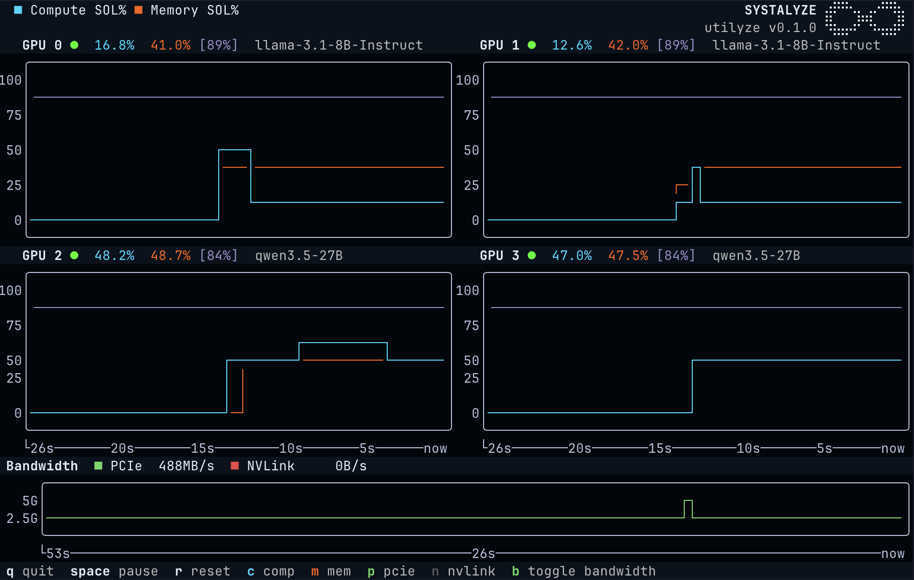

# Utilyze



常见的GPU占用率测量工具，比如`nvidia-smi` 或者 `nvtop`，仅仅在测量GPU上是否有运算在执行。即使你的任务只用了很小一部分硬件实际算力，它们也可能显示 100%。

Utilyze 会直接读取 GPU 性能计数器，告诉你硬件资源到底实际用了多少；同时还会结合当前运行的模型和硬件配置，估算在现有条件下利用率上限是多少。想了解更多，可以看看[我们的博客文章](https://systalyze.com/utilyze)。
Utilyze 由 [Systalyze](https://systalyze.com) 开发。

**其他语言版本：** [English](./README.md)

## 环境要求

- Linux amd64（arm64实验性支持）
- NVIDIA Ampere 及更新版本的GPU（A100、H100、H200、B200、RTX 3000 系列或者更新）
- CUDA Toolkit 11.0+
- `sudo` 或 `CAP_SYS_ADMIN`，或者跑在特权容器(privileged container)里

## 安装

```bash
curl -sSfL https://systalyze.com/utilyze/install.sh | sh
```

系统级安装需要 root权限，装的时候会让你输密码。

如果系统里没有 CUPTI 12+，第一次运行时会提示你从 PyPI 进行安装。

## 用法

```bash
# 监控所有 GPU
sudo utlz

# 只看特定卡
sudo utlz --devices 0,2

# 看每张卡上跑着哪些推理服务
sudo utlz --endpoints
```

同一张卡同时只能被一个 `utlz` 实例监控，这是 NVIDIA Perf SDK 的限制。

## 可达 SOL 是什么

Utilyze 会自动发现正在运行的推理服务器，从而识别每张 GPU 当前加载的是哪个模型。基于这些信息，它会计算一个“可达的计算 SOL 上限”，也就是在当前模型和硬件条件下，更贴近现实的性能上界。

目前 Utilyze 只支持把 vLLM 作为后端，后续还会支持更多后端，例如 SGLang。我们也在持续扩展支持的模型和硬件范围。当前版本支持节点内的部分模型，以及 H100-80G 和 A100-80G GPU（最多 8 张 GPU）。

为了实现这项功能，Utilyze 会匿名地将 GPU 配置信息发送到 Systalyze 的服务器。你可以通过设置 UTLZ_DISABLE_METRICS=1 来关闭这一行为。

## 不想加 sudo？

默认情况下，NVIDIA 只允许管理员访问 GPU profiling 计数器。如果你想让普通用户也能访问，需要在宿主机上关闭这个限制，然后重启：

```bash
echo 'options nvidia NVreg_RestrictProfilingToAdminUsers=0' | sudo tee /etc/modprobe.d/nvidia-profiling.conf
sudo reboot
```

完成后，utlz 就可以不加 sudo 直接运行。

如果 utlz 启动时提示缺少相关 capability，你也可以通过设置 UTLZ_DISABLE_PROFILING_WARNING=1 来关闭这条警告。

## 参数选项

命令行参数（大部分也可以用环境变量设置）：

- `--endpoints`：    显示每张 GPU 上发现的推理服务端点
- `--devices` / `UTLZ_DEVICES`：监控指定 GPU（设备 ID 用逗号分隔）
- `--log` / `UTLZ_LOG`：日志输出到文件（默认不写）
- `--log-level` / `UTLZ_LOG_LEVEL`：日志级别，默认 INFO，可选 DEBUG / WARN / ERROR
- `--version`：显示版本号

只能用环境变量的：

- `UTLZ_HIGH_CONTRAST`：高对比度模式（默认开）
- `UTLZ_DISABLE_PROFILING_WARNING`：关掉启动时的 profiling 权限警告
- `UTLZ_BACKEND_URL`：设置 Systalyze roofline SOL 指标 API 的后端地址（默认：https://api.systalyze.com/v1/utilyze）
- `UTLZ_DISABLE_METRICS`：关掉程序检测和远程 API 调用

## 从源码构建

需要准备：

- Go 1.25+ (用于构建 CLI)
- Docker（用于构建兼容性更好的原生库）
- CUDA Toolkit（默认 13.1，可以用 `CUDA_VERSION` 指定）

```bash
make all                   # 构建原生库 + CLI
make dist-tarball-docker   # 用 Docker 打包原生库
make utlz                  # 只构建 CLI
```

目前已经提供对 ARM64 构建的实验性支持，使用的是 sbsa-linux CUDA target。
